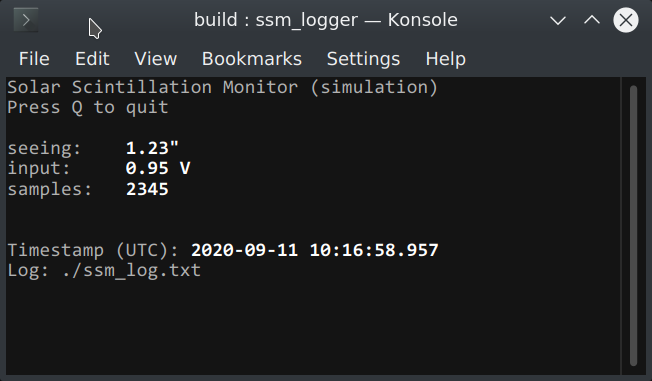

# **Solar Scintillation Monitor logger**

Copyright (C) 2017 Filip Szczerek <ga.software@yahoo.com>

This project is licensed under the terms of the MIT license (see the `LICENSE` file for details).




## Overview

Solar Scintillation Monitor logger captures the data sent by SSM over serial port. See https://github.com/GreatAttractor/ssm for the corresponding Arduino code. It uses the standard communications protocol (new-line terminated strings: `A0: x.xx` for the input voltage, `A1: x.xx` for the value of seeing in arc seconds). The data can be optionally saved to a text file in CSV format.


## Building

Required libraries: Boost (`system`, `program_options`), NCurses. Tested under Linux and Windows/MSYS.

Clone the sources:
```
git clone https://github.com/GreatAttractor/ssm_logger
```

Build with CMake:
```
cd ssm_logger
mkdir build
cd build
cmake -G "Unix Makefiles" -DCMAKE_BUILD_TYPE=Release ..
make
```

Under MSYS specify: `-G "MSYS Makefiles"`. Note that NCurses fails to initialize if `ssm_logger` is launched from within the MSYS shell; launch it from Windows shell instead.
